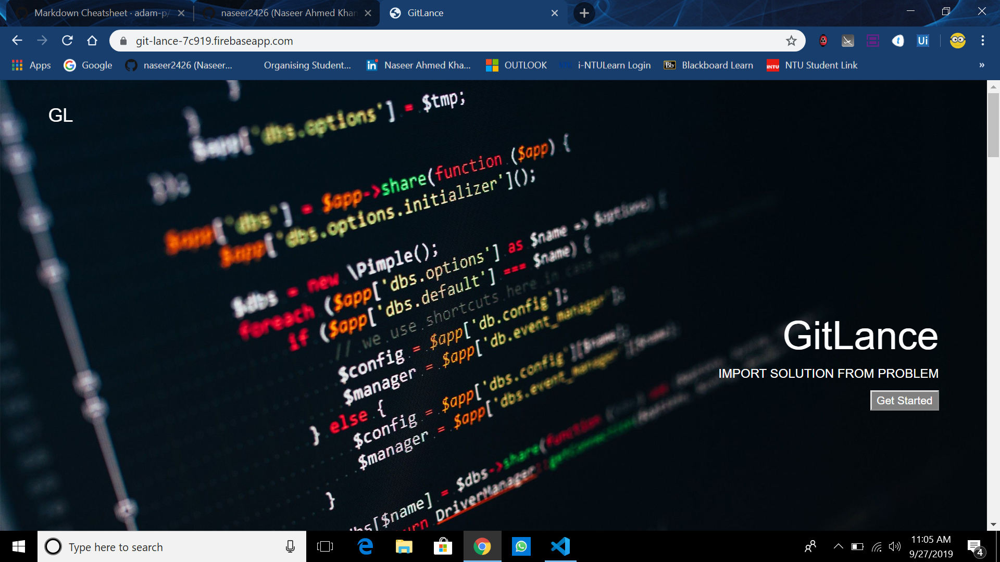
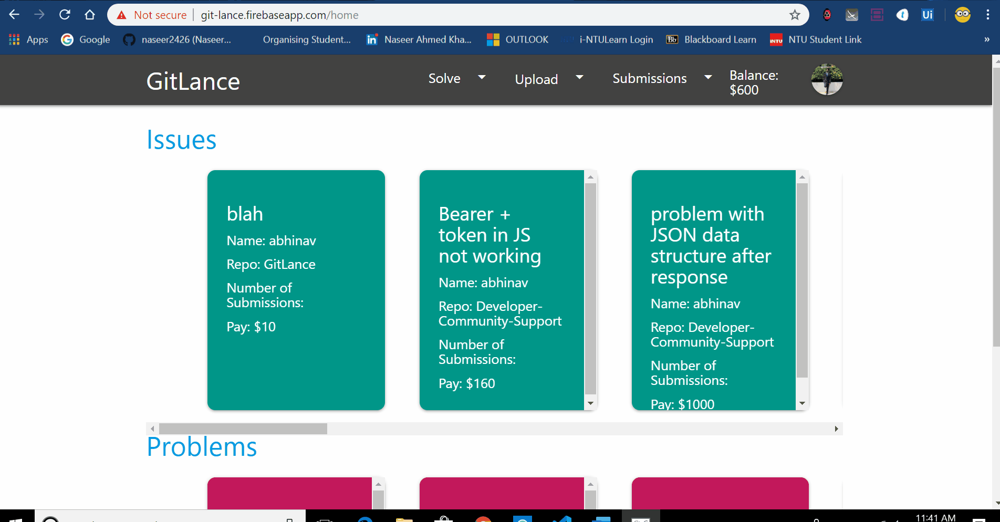
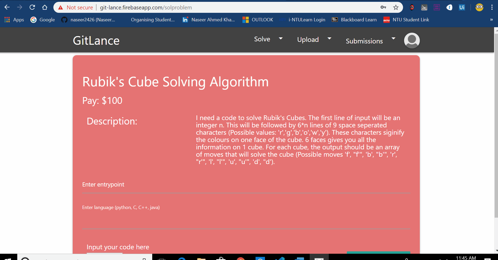
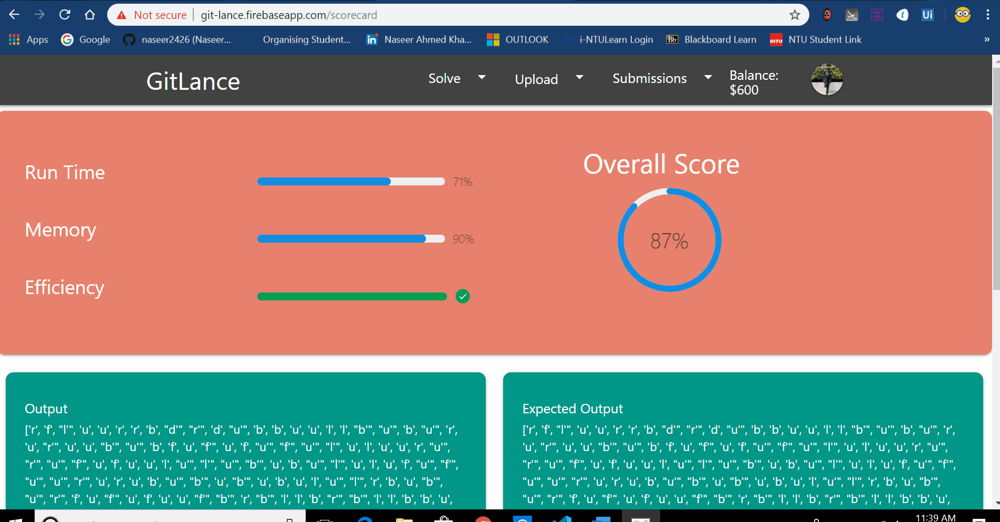
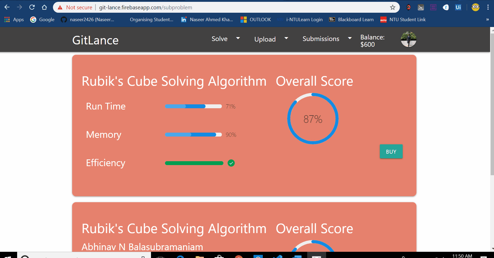

# [Gitlance](https://git-lance.firebaseapp.com)

## What is it?

Gitlance is a website where freelancers can work on jobs uploaded by a startup/individuals. <i>This platform was built to prevent scamming</i>. The startup can run test cases on the uploaded code but will not be able to look at the code, until they pay the freelancer. Check out the website [here](https://git-lance.firebaseapp.com) . The website currently not being hosted anymore :(

### Homepage

### Your feed

### Solution Upload

### Scorecard

### Company buying your code

## Why is it needed?

Coding is a job that not only takes <i>skill</i>, but also <i>patience</i>. This is why a lot of coders prefer working as freelancers. They love the freedom of choice.

The problem with being a freelancer is a lack of contract that guarentees payment. Once the hirer recieves the product made by the freelacer, most of the times he has no obligation to pay him.

The same problem goes for hirers who pay the freelancer by just watching a demo of the product and later get scammed with a product that doesn't work

GitLance intends to solve this problem and prevent both the hirer and freelancer from getting scammed. Gitlance provides a platform where hirers can compile and run test cases on the freelancers code without actually having access to the code. This way they can make sure the product works. Since they don't get to see the code until they pay the freelancers, both the parties can avoid getting scammed.

## How was it built?

#### Compiler API

The Compiler REST API used to run test cases on the submitted code is a docker container deployed on AWS Beanstalk, which uses express, child_process, multer, unzipper, javac, java, g++, gcc, python and valgrind.This API can compile and run code in java, c, c++ or python with an stdin and send back the response of the stdout, along with time and memory used by the code. You can view the code in [Docker](https://github.com/ABHINAV112/GitLance/tree/master/Docker). You can see the full documentation of the code and demo [HERE](https://github.com/naseer2426/Compiler-REST-API)

#### Front-End

The front end was entirely built using React, which is deployed on a firebase server. You can view the front end code in [client->src](https://github.com/ABHINAV112/GitLance/tree/master/client/src)

#### Back-End

The entire back end of GitLance was coded using exress, and deployed as firebase functions. These functions give access to the firebase database and firebase storage used to store our data and files. You can view the back end code in [server->functions](https://github.com/ABHINAV112/GitLance/tree/master/server/functions)
